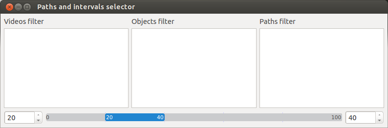

#PathsAndIntervalsSelectorDialog

This dialog allow the user to select objects paths and define frame intervals for each video.

## Functions
***************************

#### refresh_videos_list()

Refresh the videos names in the list.

#### refresh_objects_list()

Refresh the objects in the list.

#### refresh_paths_list()

Refresh the paths names in the list.

#### update_videos()

Update the videos. Should be called when the videos present in the project are added or removed.

#### update_objects()

Update the objects. Should be called when the objects present in the project are added or removed.

#### update_paths()

Update the paths. Should be called when the paths present in the project are added or removed.

## Events
***************************

#### video_selection_changed_event()

Called when the current selected video changed

## Properties
***************************

#### paths

Return all the selected paths

#### selected_data

Return all the videos with their intervals and the selected paths. Format: [(video,(first frame, last frame), [path,path]), ...]

#### current_video

Returns the current selected video model.

#### current_video_capture

Returns the current cv2.VideoCapture object of the selected video model.

#### project

Returns and sets the current project model, used to populate the dialog with data.
